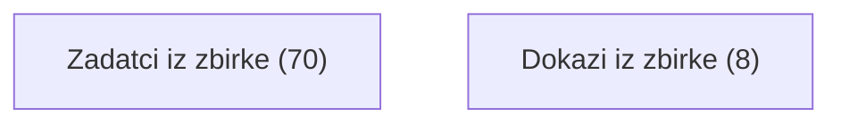
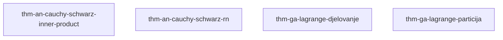

# Graf ovisnosti

> [!TIP] Ovo je statični Obsidian-prikaz. **Interaktivni prikaz** — sklopive cjeline, označavanje napretka (savladano / spremno / nije spremno), pretraga — je `views/forest.html`: otvori ga **u pregledniku** (dvoklik u file manageru), ne u Obsidianu.

Bridovi su `depends` veze: strelica vodi od preduvjeta prema stablu
koje ga treba. Graf je tranzitivno reduciran — brid koji slijedi iz
duljeg puta je izostavljen. Dokazi (`prf-`) i zadatci (`exr-`) su
izostavljeni radi čitljivosti; potpuni interaktivni prikaz je
`views/forest.html`.

*(Generirano 2026-09-09 alatom forest-digest.)*

## Pregled po cjelinama

## Zadatci iz zbirke

*(samo dokazi/zadatci — vidi forest.html)*

## Dokazi iz zbirke

- [[thm-an-cauchy-schwarz-inner-product]] — Cauchy-Schwarz inequality in an inner product space via orthogonal projection
- [[thm-an-cauchy-schwarz-rn]] — Cauchy-Schwarz inequality in R^n via Lagrange's identity
- [[thm-ga-lagrange-djelovanje]] — Lagrange's theorem via a free group action
- [[thm-ga-lagrange-particija]] — Lagrangeov teorem: dokaz preko particije na kosete
