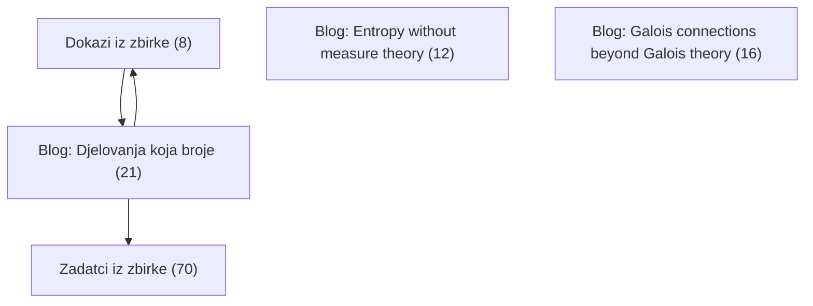
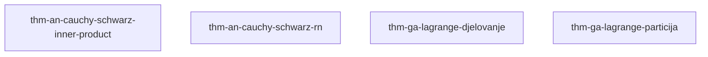
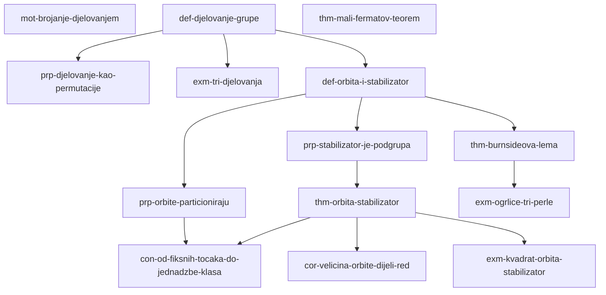
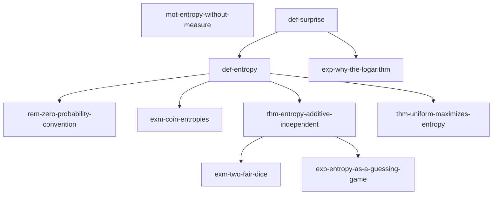
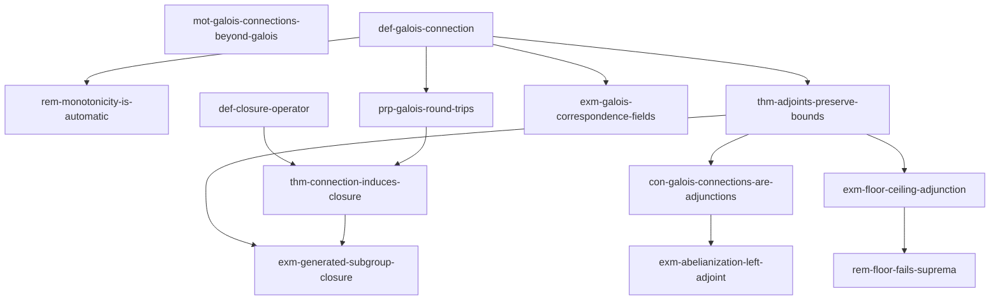

# Graf ovisnosti

> [!TIP] Ovo je statični Obsidian-prikaz. **Interaktivni prikaz** — sklopive cjeline, označavanje napretka (savladano / spremno / nije spremno), pretraga — je `views/forest.html`: otvori ga **u pregledniku** (dvoklik u file manageru), ne u Obsidianu.

Bridovi su `depends` veze: strelica vodi od preduvjeta prema stablu
koje ga treba. Graf je tranzitivno reduciran — brid koji slijedi iz
duljeg puta je izostavljen. Dokazi (`prf-`) i zadatci (`exr-`) su
izostavljeni radi čitljivosti; potpuni interaktivni prikaz je
`views/forest.html`.

*(Generirano 2026-09-09 alatom forest-digest.)*

## Pregled po cjelinama

## Zadatci iz zbirke

*(samo dokazi/zadatci — vidi forest.html)*

## Dokazi iz zbirke

- [[thm-an-cauchy-schwarz-inner-product]] — Cauchy-Schwarz inequality in an inner product space via orthogonal projection
- [[thm-an-cauchy-schwarz-rn]] — Cauchy-Schwarz inequality in R^n via Lagrange's identity
- [[thm-ga-lagrange-djelovanje]] — Lagrange's theorem via a free group action
- [[thm-ga-lagrange-particija]] — Lagrangeov teorem: dokaz preko particije na kosete

## Blog: Djelovanja koja broje

- [[mot-brojanje-djelovanjem]] — Zašto brojiti djelovanjem grupe
- [[def-djelovanje-grupe]] — Djelovanje grupe na skupu
- [[prp-djelovanje-kao-permutacije]] — Djelovanje je isto što i homomorfizam u Sym(X)
- [[exm-tri-djelovanja]] — Tri djelovanja za kalibraciju
- [[def-orbita-i-stabilizator]] — Orbita i stabilizator
- [[prp-orbite-particioniraju]] — Orbite particioniraju skup
- [[prp-stabilizator-je-podgrupa]] — Stabilizator je podgrupa
- [[thm-orbita-stabilizator]] — Teorem orbita–stabilizator
- [[cor-velicina-orbite-dijeli-red]] — Veličina orbite dijeli red grupe
- [[exm-kvadrat-orbita-stabilizator]] — Vrhovi kvadrata: orbita 4, stabilizator 2
- [[thm-mali-fermatov-teorem]] — Mali Fermatov teorem
- [[thm-burnsideova-lema]] — Burnsideova lema: broj orbita je prosjek fiksnih točaka
- [[exm-ogrlice-tri-perle]] — Ogrlice od tri perle u dvije boje
- [[con-od-fiksnih-tocaka-do-jednadzbe-klasa]] — Od brojanja orbita do jednadžbe klasa

## Blog: Entropy without measure theory

- [[mot-entropy-without-measure]] — What entropy is for, and why finite probability suffices
- [[def-surprise]] — Surprise of an outcome
- [[def-entropy]] — Entropy of a discrete random variable
- [[rem-zero-probability-convention]] — Why impossible outcomes contribute zero
- [[exm-coin-entropies]] — Three coins: 1 bit, 0.47 bits, 0 bits
- [[exp-why-the-logarithm]] — Why the logarithm, and not some simpler formula
- [[thm-entropy-additive-independent]] — Entropy is additive over independent variables
- [[exm-two-fair-dice]] — Two dice carry twice the entropy of one
- [[thm-uniform-maximizes-entropy]] — The uniform distribution maximizes entropy
- [[exp-entropy-as-a-guessing-game]] — Entropy as a guessing game: the price of identification

## Blog: Galois connections beyond Galois theory

- [[mot-galois-connections-beyond-galois]] — Why Galois connections are not about fields
- [[def-galois-connection]] — Galois connection
- [[rem-monotonicity-is-automatic]] — Monotonicity comes free, and each adjoint determines the other
- [[prp-galois-round-trips]] — Round trips in a Galois connection
- [[thm-adjoints-preserve-bounds]] — Left adjoints preserve suprema, right adjoints preserve infima
- [[exm-floor-ceiling-adjunction]] — Floor and ceiling as the two adjoints of Z into R
- [[rem-floor-fails-suprema]] — Floor shrugs at suprema
- [[exm-galois-correspondence-fields]] — Subgroups and fixed fields: the eponymous connection
- [[def-closure-operator]] — Closure operator
- [[thm-connection-induces-closure]] — Every Galois connection induces a closure operator
- [[exm-generated-subgroup-closure]] — Generated subgroups as a closure operator
- [[con-galois-connections-are-adjunctions]] — Galois connections are adjunctions between thin categories
- [[exm-abelianization-left-adjoint]] — Abelianization: a left adjoint earning its keep
